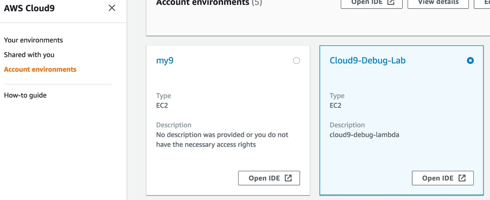

# Building and Debugging Serverless Applications with Cloud9

Build a simple Lambda Function that sits behind an API gateway endpoint, learn how to use the Cloud9 IDE to Build, Debug and Deploy this Function.

## Introduction
This lab aims to show users how easy it is to create, build, test and deploy a Lambda function behind an API Gateway Endpoint using Cloud9.  The function will initially run locally in the Cloud9 environment, where we will debug it to gain an understanding, before changing it to suit our needs, and finally deploying it into AWS.

### Setup
1. Goto to AWS Console
   - Goto Cloud9
   - Go to Account Environments.
   - Select Open IDE 
   
  
- Find the Environment called Cloud9-Debug-Lab and select the "Open IDE" button.
- A new Cloud9 enviroment will open with a few files already checked out from this git repo.
- Once the Cloud9 environment has opened you will see a Folder Structure on the LHS that contains a folder called "isPalindrome". This is also the location of further instructions
